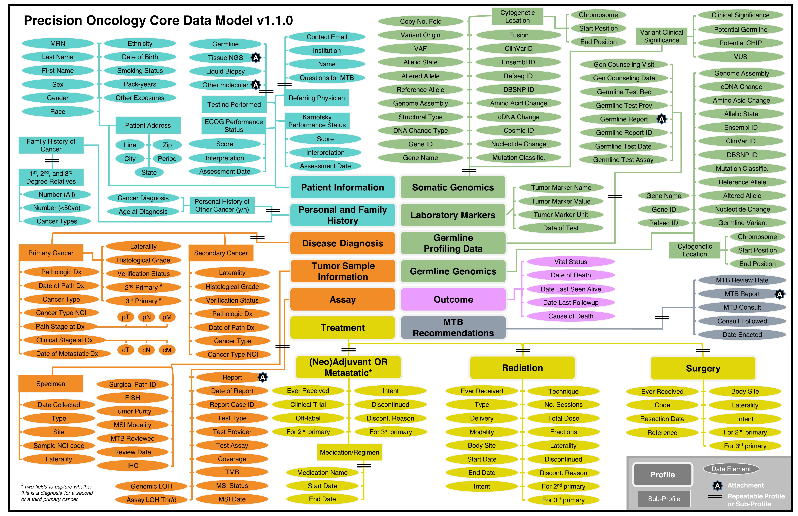

# Precision Oncology Core Data Model
{: .fs-8 }

The Sidney Kimmel Comprehensive Cancer Center at the Johns Hopkins University has developed the **Precision Oncology Core Data Model (Precision-DM**) to support data standardization, improve harmonization and organization, enable automated retrieval of genomic and clinical features, and facilitate data transfer within and across institutions.
{: .fs-6 .fw-300 }

{: .new }
> **Latest version `1.1.0` is available!**

> The structure of Precision-DM, including the profiles, sub-profiles, and data elements, is illustrated in the following diagram.
> See [Precision-DM Versions]() for a detailed description of the latest version.
> 

[View Precision-DM on GitHub](https://github.com/PrecisionOncology/Precision-DM-repo/){: .btn .fs-5 .mb-4 .mb-md-0 }{:target="_blank"}